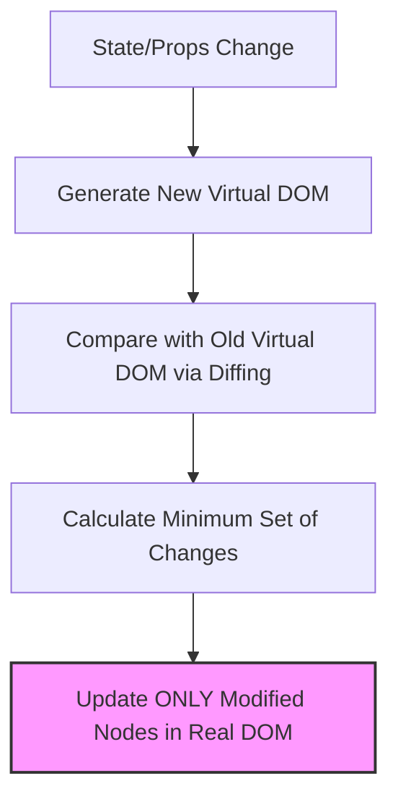
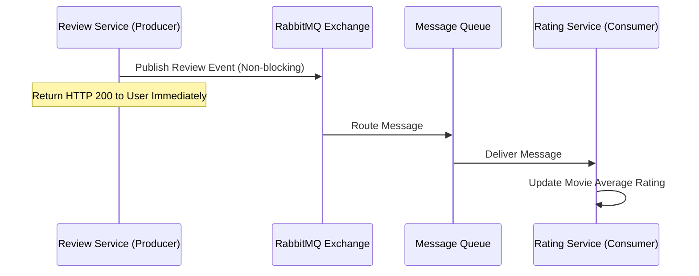

# CineVerse Project: Day 01 Academic Theory & Architecture Answers

This document provides detailed, academically rigorous answers to the Day 01 questions for the **CineVerse** movie ticket booking and discovery platform.

---

## 5. Why is React.js suitable for modern frontend development?
React.js is a component-based JavaScript library developed by Meta (Facebook) that has become the industry standard for front-end development due to several key factors:
- **Component-Based Architecture**: React allows developers to break down the user interface into small, isolated, and reusable code blocks called *Components*. This makes the codebase modular, easier to maintain, and simpler to test.
- **Declarative UI**: Instead of manually manipulating the DOM (imperative programming), developers describe *what* the UI should look like for a given state. React handles the updates automatically when the state changes.
- **Unidirectional Data Flow**: React uses one-way data binding (from parent to child via `props`), which makes data tracking, debugging, and understanding application behavior predictable.
- **Rich Ecosystem & Community**: React has a massive developer community and an extensive ecosystem of third-party libraries (for routing, state management, UI components, etc.), speeding up development cycles.

---

## 6. What is the Virtual DOM in React?
The **Virtual DOM (VDOM)** is a lightweight, in-memory representation of the real browser DOM. 
Directly manipulating the browser DOM is computationally expensive because any change triggers a layout recalculation and repaint of the page. React solves this performance bottleneck via the VDOM:
1. **Creation**: When a component's state or props change, React creates a new Virtual DOM tree representing the updated UI.
2. **Reconciliation (Diffing)**: React compares the new Virtual DOM tree with the previous Virtual DOM tree using a highly efficient "diffing" algorithm.
3. **Batching & Patching**: React identifies the exact difference (delta) and updates *only* the changed elements in the real browser DOM (a process called *reconciliation* or *patching*), rather than reloading the entire page.



---

## 7. How does Spring Boot simplify backend development?
Spring Boot is an extension of the Spring Framework that eliminates boilerplates and simplifies microservices setup through:
- **Opinionated Configuration**: Spring Boot configures default behaviors automatically (e.g., configuring a datasource, web server, etc.) so developers don't have to write complex XML or Java configuration classes.
- **Starter Dependencies**: It bundles related dependencies under unified "Starters" (e.g., `spring-boot-starter-web`, `spring-boot-starter-data-jpa`), simplifying dependency management in `pom.xml` or `build.gradle`.
- **Embedded Web Servers**: It embeds web servers (like Tomcat, Jetty, or Undertow) directly within the application package (`JAR`). Developers can run the application using a single command without needing external server setups.
- **Production-Ready Features**: It includes out-of-the-box support for health checks, metrics, and application monitoring through Spring Boot Actuator.

---

## 8. Compare PostgreSQL and MongoDB with use cases.

| Feature | PostgreSQL (SQL) | MongoDB (NoSQL) |
| :--- | :--- | :--- |
| **Data Model** | Relational (Tables, Rows, Columns) | Non-Relational (JSON-like Documents) |
| **Schema** | Strict, pre-defined schema | Dynamic, flexible schema |
| **Consistency** | Strong Consistency (ACID compliant) | Eventual Consistency (Tunable, BASE) |
| **Transactions** | Complex multi-row JOINs & ACID transactions | Single-document ACID (multi-doc supported but less optimized) |
| **Scaling** | Primarily Vertical (Scale Up) | Horizontal (Scale Out via Sharding) |

### Use Cases:
- **PostgreSQL**: Ideal for systems requiring transactional integrity, relationships, and financial accuracy (e.g., **Auth Service** storing user credentials, **Booking Service** managing seat reservations and payments).
- **MongoDB**: Ideal for rapid development, unstructured data, and high-volume reads (e.g., **Movie Catalog** storing diverse metadata, actor details, genre lists, and user wishlists where schemas can change frequently).

---

## 9. What is caching and why is Redis used?
**Caching** is the process of storing copies of frequently requested data in a fast, temporary storage layer (usually RAM) to retrieve it faster than querying the primary database.

**Redis (Remote Dictionary Server)** is an open-source, in-memory data structure store used as a distributed cache.
- **Reduces Database Load**: Frequently queried, static data (e.g., "Trending Movies") is fetched from Redis instead of executing expensive SQL queries.
- **Improves Latency**: Since Redis keeps data entirely in memory, access speeds are sub-millisecond, compared to database disc reads which take several milliseconds.
- **Supports Complex Data Structures**: Unlike simple key-value caches, Redis supports Lists, Sets, Hashes, and Sorted Sets, making it versatile.

---

## 10. Explain asynchronous communication using RabbitMQ.
In microservices, services often need to communicate. **Synchronous communication** (like HTTP REST) blocks the thread and waits for a response, which can cause cascading failures and slow down the user. 
**Asynchronous communication** decouples services by letting them communicate through message queues.

**RabbitMQ** is a message broker that implements this:
1. **Producer**: The service that creates and sends a message (e.g., `Review Service` when a user writes a review).
2. **Exchange**: Receives messages from producers and routes them to queues based on routing keys.
3. **Queue**: Buffer store that holds the messages until they are consumed.
4. **Consumer**: The service that reads and processes the message (e.g., `Notification Service` sending an email or updating the movie rating score).



---

## 11. What is JWT and how does authentication flow work?
**JWT (JSON Web Token)** is a compact, URL-safe standard (RFC 7519) for securely transmitting information between parties as a JSON object. It is digitally signed (using a secret key or public/private key pair).

### JWT Authentication Flow:
1. **Authentication**: The client sends credentials (username/password) to the `/auth/login` endpoint of `Auth Service`.
2. **Token Generation**: The server verifies credentials and generates a JWT. The token contains claims (e.g., `userId`, `roles`, `expiration`).
3. **Client Storage**: The server returns the JWT in the response. The client stores it (usually in `localStorage` or secure cookies).
4. **Subsequent Requests**: For every protected resource request, the client includes the JWT in the HTTP header:
   `Authorization: Bearer <token>`
5. **Validation**: The API Gateway or target microservice decodes the token, verifies the signature, and grants access if valid.

---

## 12. Why is JWT considered stateless?
JWT is **stateless** because the server does not store user session data in its memory (like database sessions or Redis cache sessions) to authenticate requests. 
- **Self-Contained**: The token itself contains all the user authentication and authorization details (claims) needed to identify the requester.
- **Cryptographic Verification**: The server only needs to verify the cryptographic signature of the token using its secret key. If the signature matches, the server trusts the contents of the token.
- **Scalability Benefit**: This eliminates session replication issues across multiple server nodes in a microservice environment, allowing services to scale horizontally without sharing session databases.

---

## 13. What are the responsibilities of an API Gateway?
An **API Gateway** acts as the single entry point for all client requests. Its core responsibilities include:
- **Request Routing**: Directs client requests to appropriate backend microservices (e.g., routing `/api/movies` to Movie Service).
- **Authentication & Authorization**: Validates incoming JWTs centrally, ensuring unauthorized requests never reach downstream services.
- **Rate Limiting / Throttling**: Prevents DDoS attacks and API abuse by limiting the number of requests a user can make in a given timeframe.
- **SSL Termination**: Handles SSL decryption at the gateway to relieve backend microservices from the overhead.
- **CORS Configuration**: Handles Cross-Origin Resource Sharing settings globally.

---

## 14. What are the advantages of Docker?
Docker is a containerization platform that packages applications and all their dependencies (runtime, system libraries, configuration) into a single container:
- **Environment Consistency**: Solves the "works on my machine" problem. The application runs identically in development, testing, staging, and production environments.
- **Isolation**: Containers run in isolated environments, preventing version conflicts between libraries needed by different services.
- **Lightweight**: Unlike Virtual Machines, containers share the host operating system's kernel, making them spin up in seconds and consume minimal resources.
- **Portability**: Any system running Docker can execute the container, simplifying cloud deployments (AWS, Azure, GCP).

---

## 15. What is CI/CD and why is it important?
**CI/CD** stands for Continuous Integration and Continuous Deployment/Delivery. It is a set of operating principles and practices that automate software releases:
- **Continuous Integration (CI)**: Developers merge their code changes back to the main branch frequently. Automated builds and unit tests run on every commit to catch integration bugs early.
- **Continuous Delivery/Deployment (CD)**: Automatically deploys the tested code to production or staging environments.
- **Importance**:
  - Reduces manual testing and deployment overhead.
  - Minimizes release risk by deploying smaller, incremental changes.
  - Accelerates feedback loops, delivering value to users faster.

---

## 16. Why is requirement analysis important before architecture design?
Requirement analysis is the process of identifying, documenting, and prioritizing **Functional Requirements** (what the system should do, e.g., book a ticket) and **Non-Functional Requirements** (how it behaves, e.g., low latency, scalability).

It is critical because:
- **Prevents Over-engineering**: If a system expects 100 users, designing a complex distributed microservice architecture with Kubernetes is a waste of resources.
- **Guides Database and Tech Selection**: Financial transaction modules require ACID databases (SQL), while real-time chats benefit from WebSockets and document databases (NoSQL).
- **Defines Cost and Timeline**: Non-functional requirements directly impact cloud hosting costs and deployment timelines.

---

## 17. How do frontend and backend communicate in a full-stack application?
Frontend and backend communicate over the network using standard communication protocols:
- **HTTP REST APIs**: The frontend sends an HTTP request (GET, POST, PUT, DELETE) to the backend API. The backend processes the request and returns data, usually formatted as a JSON response.
- **WebSockets**: Used for real-time bi-directional communication (e.g., updating seat reservations in real-time without refreshing the page).
- **GraphQL**: Allows the frontend to request specific data schemas, reducing over-fetching.

In CineVerse, communication flows via HTTP:
`React Frontend` → `Axios/Fetch` → `HTTP REST Request` → `API Gateway (8080)` → `Microservice` → `JSON Response` → `React UI updates`

---

## 18. What are REST APIs?
**REST (Representational State Transfer)** is an architectural style for designing networked applications. A RESTful API adheres to six key constraints:
1. **Client-Server Architecture**: Separation of concerns between client (UI) and server (data/logic).
2. **Statelessness**: Every request contains all the information needed to process it; the server stores no client context.
3. **Cacheability**: Responses must define themselves as cacheable or not to improve network efficiency.
4. **Layered System**: Clients cannot tell if they are connected directly to the end server or an intermediate broker (like a gateway or cache).
5. **Uniform Interface**: Uses standard HTTP methods (GET, POST, PUT, DELETE) and resource-oriented URLs (e.g., `/api/movies/{id}`).
6. **Code on Demand (Optional)**: Servers can temporarily extend client functionality by transferring executable code.

---

## 19. Why is project architecture important before development?
Developing without a blueprint leads to unstructured, unmaintainable code (spaghetti code). Establishing architecture beforehand:
- **Aligns the Development Team**: Defines clean boundaries, interfaces, and responsibilities for each team member.
- **Ensures Code Maintainability**: Decoupled modules allow developers to modify or rewrite components without breaking the entire application.
- **Future-Proofs the Application**: Simplifies scaling, security updates, and integrations of third-party systems.

---

## 20. Explain horizontal vs vertical scaling.
- **Vertical Scaling (Scaling Up)**: Increasing the capacity of a single server by adding more resources (CPU, RAM, Storage).
  - *Pros*: Simple, no change in application code.
  - *Cons*: Has hardware limits; single point of failure; expensive at scale.
- **Horizontal Scaling (Scaling Out)**: Adding more server nodes to the system to distribute the load.
  - *Pros*: Theoretically infinite scale; high availability (if one node fails, others handle traffic).
  - *Cons*: Requires load balancers, database clustering, and distributed architecture.

```
Vertical Scaling (Scale Up)          Horizontal Scaling (Scale Out)
  [ Small Server ]                     [ Server 1 ]  [ Server 2 ]  [ Server 3 ]
        |                                   \             |             /
        v                                    \            v            /
  [ Giant Server ]                           [ Load Balancer (Gateway) ]
```

---

## 21. What are the challenges of microservices architecture?
While highly scalable, microservices introduce several complexities:
- **Distributed System Complexity**: Coordinating network calls, network latency, and service availability.
- **Data Consistency**: Maintaining consistency across multiple database instances (requires eventual consistency models, Saga pattern, etc.).
- **Operational Overhead**: Requires strong DevOps pipelines, container orchestration (Kubernetes), and monitoring (distributed tracing, log aggregation).
- **Security Boundaries**: Protecting multiple service endpoints requires robust central validation at the gateway.

---

## 22. How does system design impact performance and scalability?
System design determines how well a system responds to workloads:
- **Performance (Response Time)**: Optimized by choosing correct database indexes, memory caching (Redis), and minimizing network hops. Bad design (e.g. N+1 query problem, synchronous blocking calls) degrades performance under minimal load.
- **Scalability (Load Management)**: Designing stateless services enables horizontal scaling behind a load balancer. If services are stateful (e.g. storing sessions locally), scaling causes users to lose their sessions, limiting growth capacity.
- **Availability (Uptime)**: Designing redundant database clusters and circuit-breakers prevents single service crashes from taking down the entire platform.
